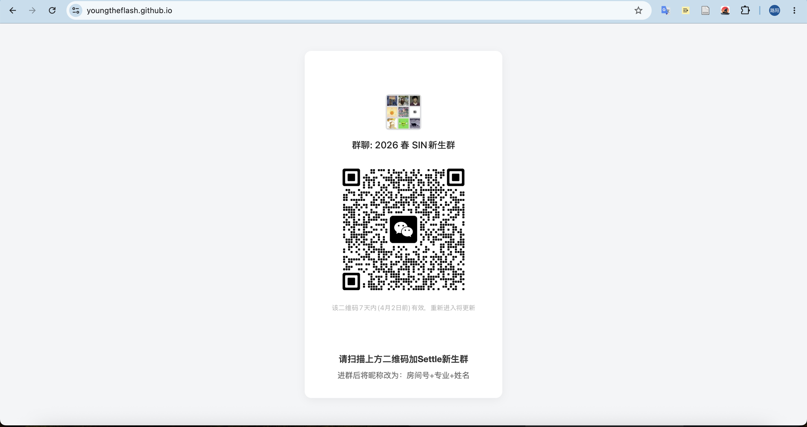

# SNS Group Invitation QR Code Page

**期限切れのないSNSグループ招待QRコードを配信する静的ウェブサイト**
**A static website that always serves a valid SNS group invitation QR code**

<p align="center"></p>
<p>
  
  
  
  
  
</p>

🔗 **Live site — [youngtheflash.github.io](https://youngtheflash.github.io/)**

**[日本語](#日本語) ・ [English](#english)**

---

## 日本語

### 概要

来日を控えた中国からの入居者が、質疑応答用のSNSグループに参加するための
**招待QRコードを常に有効な状態で表示するウェブサイト**です。

寮の運営メンバーとして課題を発見し、ミーティングで提案・合意を得たうえで、
設計から実装・公開・運用までを個人で担当しました。

| | |
|---|---|
| **役割** | 個人開発（企画・設計・実装・運用） |
| **技術** | HTML / CSS / JavaScript / GitHub Pages |
| **公開時期** | 2026年2月 〜 運用中 |
| **利用者** | 新入居予定の留学生 40名以上、および大学の留学課 |

### 解決した課題

SNSのグループ招待QRコードには**約1週間の有効期限**があります。
これが、来日前の新入生への案内フローにおいて大きな運用負荷を生んでいました。

#### 導入前

```
QRコードが失効
      ↓
寮のメンバーが新しいQRコードを生成
      ↓
留学課へメールで送付
      ↓
留学課が新入生全員へ一斉再送
      ↓
（1週間後、最初に戻る）
```

期限が切れるたびに、**寮側・留学課・新入生の三者すべてに再連絡の手間**が発生していました。
新入生側も「受け取ったQRコードがすでに使えない」という状態に頻繁に遭遇していました。

#### 導入後

```
留学課は「1本のURL」を一度だけ案内すればよい
      ↓
新入生はいつアクセスしても、常に有効なQRコードが表示される
      ↓
寮側は画像を差し替えるだけ（コミット1回・約30秒）
```

| 項目 | 導入前 | 導入後 |
|------|--------|--------|
| 留学課への依頼 | 失効のたびに毎回 | **不要**（初回の案内のみ） |
| 新入生への再送 | 失効のたびに一斉送信 | **不要** |
| 期限切れQRの受信 | 頻繁に発生 | **発生しない** |
| 運用作業 | 都度メール調整 | 画像を1枚差し替えるのみ |

### 設計上の工夫

#### 1. URLは不変・中身だけ可変にする

本プロジェクトの中心となる考え方です。
**外部に配布するURLを固定し、その先の画像だけを差し替える**構成にしたことで、
「配布物が古くなる」という問題そのものを構造的に取り除きました。

留学課は最初の一度だけURLを案内すれば、以降の対応が一切不要になります。

#### 2. キャッシュ対策（タイムスタンプによる cache busting）

上記の設計には落とし穴があります。画像のファイル名が `qrcode.jpg` のまま変わらないため、
**ブラウザが古い画像をキャッシュから表示してしまう**と、
せっかく差し替えても利用者には失効済みのQRコードが見えてしまいます。

GitHub Pages では独自の `Cache-Control` ヘッダを設定できないため、
クライアント側でアクセスのたびに一意なURLを生成する方式を採用しました。

```javascript
// 現在時刻のミリ秒（重複しない値）をクエリパラメータとして付与し、
// ブラウザに毎回サーバから画像を取得させる
var timestamp = new Date().getTime();
document.getElementById('qr-image').src = 'qrcode.jpg?t=' + timestamp;
```

これにより、リクエストURLが毎回異なるものとなり、キャッシュを確実に回避しています。
サーバ側の設定を変更できない制約の中で、クライアント側の実装で要件を満たした点が工夫箇所です。

#### 3. モバイルファーストのUI

利用者は全員スマートフォンからアクセスし、その場でQRコードを読み取ります。
そのため、以下の点を重視しました。

- **Flexbox による上下左右の中央配置** — 画面サイズを問わず視線の中心にQRコードが来る
- **可変幅のカード**（`max-width: 320px` / `width: 85%`）— 小型端末でも見切れない
- **`viewport` メタタグ** — 端末幅に応じた適切なレンダリング
- **十分な表示サイズ** — 別の端末のカメラからでも読み取れる大きさを確保
- **カード型UI**（角丸・淡い影・グレー背景）— 情報を1点に集中させ、迷わせない

#### 4. 運用コストの最小化

- **GitHub Pages によるホスティング** — サーバ費用・保守作業ともにゼロ
- **依存ライブラリなし** — フレームワーク不要、更新による破損リスクがない
- **単一ファイル構成** — 引き継ぎが容易で、後任者でもすぐ運用できる

#### 5. 対象利用者に合わせたローカライズ

利用者が中国からの入居者であるため、UIの表示言語は中国語（`lang="zh-CN"`）としています。
QRコードの下には「入室後、ニックネームを『部屋番号＋専攻＋氏名』に変更する」という
案内文を併記し、**グループ参加後の管理者側の手間も同時に削減**しました。

### 技術スタック

| 分類 | 使用技術 |
|------|---------|
| マークアップ | HTML5 |
| スタイリング | CSS3（Flexbox、レスポンシブ対応） |
| スクリプト | Vanilla JavaScript（cache busting） |
| ホスティング | GitHub Pages |
| バージョン管理 | Git / GitHub |

外部ライブラリ・フレームワークは一切使用していません。

### ファイル構成

```
.
├── index.html    # ページ全体（HTML・CSS・JSを内包した単一ファイル）
├── qrcode.jpg    # 招待用QRコード画像（定期的に差し替える運用対象）
└── README.md
```

### 運用方法

QRコードの更新は、画像1枚の差し替えのみで完了します。

```bash
# 1. 新しいQRコード画像を qrcode.jpg として配置（同名で上書き）
# 2. コミットしてプッシュ
git add qrcode.jpg
git commit -m "renew QR code"
git push
```

プッシュ後、GitHub Pages が自動でデプロイし、約1分で反映されます。
利用者側の対応は不要で、次回アクセス時から新しいQRコードが表示されます。

実際の運用実績はコミット履歴に残っており、
有効期限に合わせて**約7日間隔で継続的に更新**しています。

### ローカルでの確認方法

```bash
git clone https://github.com/YoungTheFlash/YoungTheFlash.github.io.git
cd YoungTheFlash.github.io
python3 -m http.server 8000
```

ブラウザで `http://localhost:8000` を開いて確認できます。

### 成果

- **40名以上**の新入居留学生が、期限切れを気にせずグループに参加できるようになりました
- 大学の**留学課における再送業務を完全に不要化**しました
- 寮の運営側の作業を、**都度のメール調整から画像1枚の差し替え**へと簡略化しました
- 2026年2月の公開以降、**継続して運用中**です

### 学び

技術的な規模は大きくありませんが、**「実際に困っている業務をITで解決する」**という
一連の流れを、課題の発見から提案・合意形成・実装・公開・継続運用まで
自分の手で完遂できた点に、大きな達成感を得ました。

特に、

- **課題の本質を見極めること** — 「QRコードを配り直す作業」を効率化するのではなく、
  「配り直しそのものを不要にする」設計に発想を転換できたことが、解決の決め手になりました
- **制約の中で要件を満たすこと** — サーバ設定を変更できないGitHub Pagesという環境で、
  クライアント側の実装によってキャッシュ問題を解決しました
- **利用者視点での設計** — スマートフォンからの利用、中国語話者であること、
  グループ参加後の運用まで含めて考えることの重要性を学びました

という3点は、今後の開発においても意識していきたい観点です。

### 今後の改善案

- QRコードの自動生成・自動更新（GitHub Actions によるスケジュール実行）
- 多言語対応（日本語・英語の切り替え）
- 有効期限の表示、および更新日時の明示
- アクセス数の計測による利用状況の把握

---

## English

### Overview

This is a **website that always displays a valid SNS group invitation QR code** for incoming
Chinese residents preparing to move to Japan, so they can join the Q&A group for new students.

As a member of the dormitory's operating team, I identified the problem, proposed the solution at
a residents' meeting, and — after gaining agreement — handled the design, implementation,
deployment and ongoing operation myself.

| | |
|---|---|
| **Role** | Solo project (planning, design, implementation, operation) |
| **Stack** | HTML / CSS / JavaScript / GitHub Pages |
| **Launched** | February 2026 — currently in operation |
| **Users** | 40+ incoming international students, plus the university's International Student Office |

### The Problem It Solves

SNS group invitation QR codes **expire after roughly one week**. In the onboarding flow for
students still overseas, this created a significant recurring workload.

#### Before

```
QR code expires
      ↓
Dormitory member generates a new QR code
      ↓
Emails it to the International Student Office
      ↓
The office forwards it to every incoming student
      ↓
(One week later, repeat)
```

Every expiry forced **three parties — the dormitory, the office, and the students — to redo the
same communication**. Students frequently received a QR code that had already stopped working.

#### After

```
The office shares a single URL, once
      ↓
Students always see a valid QR code, whenever they visit
      ↓
The dormitory just swaps the image (one commit, ~30 seconds)
```

| | Before | After |
|---|--------|-------|
| Requests to the office | Every time it expired | **None** (one-time announcement) |
| Re-sending to students | Mass email on every expiry | **None** |
| Receiving expired QR codes | Happened frequently | **Eliminated** |
| Operational work | Email coordination each cycle | Replace a single image |

### Design Decisions

#### 1. Keep the URL permanent, make only the content mutable

This is the central idea of the project. By **fixing the URL that gets distributed and swapping
only the image behind it**, the problem of "the thing you handed out goes stale" is removed
structurally rather than merely reduced.

The International Student Office announces the link once and never has to act again.

#### 2. Cache busting with a timestamp

That design has a pitfall. Because the image filename stays `qrcode.jpg`, **the browser may serve
a cached copy** — meaning users would still see an expired QR code even after the swap.

GitHub Pages does not allow custom `Cache-Control` headers, so I solved it on the client side by
generating a unique URL on every visit.

```javascript
// Append the current time in milliseconds (a value that never repeats)
// so the browser is forced to fetch the image from the server every time
var timestamp = new Date().getTime();
document.getElementById('qr-image').src = 'qrcode.jpg?t=' + timestamp;
```

Every request now targets a distinct URL, reliably bypassing the cache. The point of interest here
is meeting the requirement purely on the client side, under a constraint that made server-side
configuration impossible.

#### 3. Mobile-first UI

Every user opens this on a smartphone and scans the code on the spot, so the interface prioritises:

- **Flexbox centering on both axes** — the QR code sits at the visual centre on any screen size
- **A fluid card** (`max-width: 320px` / `width: 85%`) — never clipped on small devices
- **A `viewport` meta tag** — correct rendering at the device's real width
- **Generous display size** — large enough to be scanned by another phone's camera
- **A card-style layout** (rounded corners, soft shadow, grey backdrop) — one focal point, no ambiguity

#### 4. Minimal operating cost

- **Hosted on GitHub Pages** — zero hosting cost and zero server maintenance
- **No dependencies** — no framework to break on an upgrade
- **A single-file structure** — easy to hand over; a successor can operate it immediately

#### 5. Localisation for the actual audience

Because the users are residents arriving from China, the UI is written in Chinese
(`lang="zh-CN"`). Below the QR code, a short instruction asks users to rename themselves to
"room number + major + name" after joining — which **also cut down the administrators' work inside
the group**, not just the work of getting people into it.

### Tech Stack

| Layer | Technology |
|-------|-----------|
| Markup | HTML5 |
| Styling | CSS3 (Flexbox, responsive) |
| Scripting | Vanilla JavaScript (cache busting) |
| Hosting | GitHub Pages |
| Version control | Git / GitHub |

No external libraries or frameworks are used.

### Project Structure

```
.
├── index.html    # The entire page (HTML, CSS and JS in a single file)
├── qrcode.jpg    # The invitation QR code — the artifact that gets rotated
└── README.md
```

### How It Is Operated

Updating the QR code means replacing one image.

```bash
# 1. Save the new QR code as qrcode.jpg (overwriting the old one)
# 2. Commit and push
git add qrcode.jpg
git commit -m "renew QR code"
git push
```

GitHub Pages deploys automatically and the change is live in about a minute. Users need to do
nothing — the new code appears on their next visit.

The commit history is the operating record: the image has been **rotated on a roughly 7-day cycle**,
matching the invitation's expiry period.

### Running It Locally

```bash
git clone https://github.com/YoungTheFlash/YoungTheFlash.github.io.git
cd YoungTheFlash.github.io
python3 -m http.server 8000
```

Then open `http://localhost:8000` in a browser.

### Results

- **40+ incoming international students** can now join the group without worrying about expiry
- **Completely eliminated** the re-sending work at the university's International Student Office
- Reduced the dormitory team's workload from **per-cycle email coordination to swapping one image**
- **Still in operation** since launching in February 2026

### What I Learned

The technical scope is modest, but I was able to carry **"solving a real operational problem with
technology"** all the way through myself — spotting the problem, proposing it, building consensus,
implementing, shipping, and keeping it running. That was genuinely rewarding.

Three things in particular I want to carry forward:

- **Identifying the real problem.** The breakthrough was reframing the goal from "make redistributing
  the QR code more efficient" to "make redistribution unnecessary altogether."
- **Meeting requirements within constraints.** GitHub Pages gave me no control over response
  headers, so I solved the caching problem on the client instead.
- **Designing from the user's perspective.** Thinking through the whole context — that they are on
  phones, that they read Chinese, and what happens after they join the group — mattered as much as
  the code itself.

### Possible Improvements

- Automatic QR generation and rotation (scheduled GitHub Actions workflow)
- Multilingual UI (Japanese / English toggle)
- Displaying the expiry date and last-updated timestamp
- Basic analytics to understand actual usage
